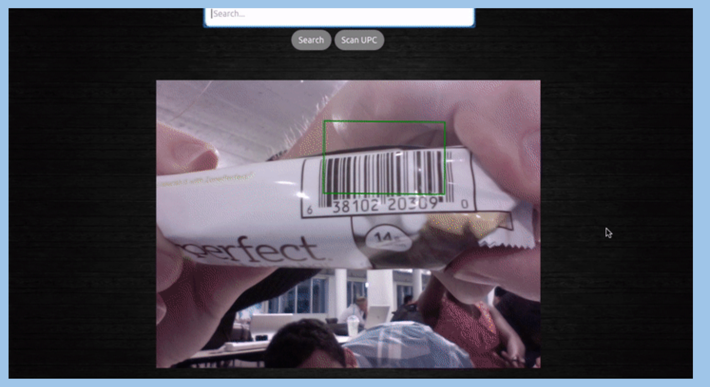

# Can I Eat This?

### Introduction

* Can I Eat This was Jahdasha Flagg, Jamie Lipschitz & Brianne Hostutler.
* It is a helpful app that can improve the lives of people with food allergies. Users are able to search any product by a UPC code and view the ingredients & allergens that product contains.
* Users will press the “Scan UPC” button, hold the UPC up to your camera, and the code will appear in the search box. Press “Search” and their results will appear!
* Or users can also manually type in the UPC code in the search text box then press the "Search" button to review their results.

* Example of the UPC Scanner

**Disclaimer: This website is not a substitute for reading the packing on a product. Always read the ingredients and allergen information before eating. “Can I Eat This?” is not responsible for any reactions that may occur after eating a product that was searched on this website.**

https://canieatthisapp.herokuapp.com/
